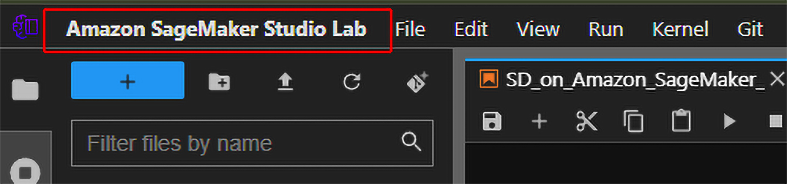
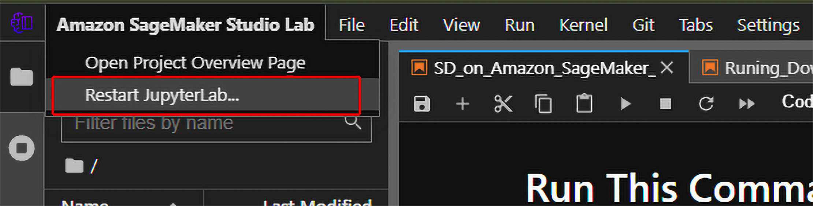
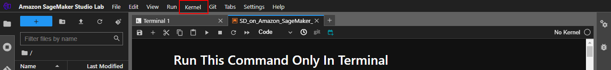
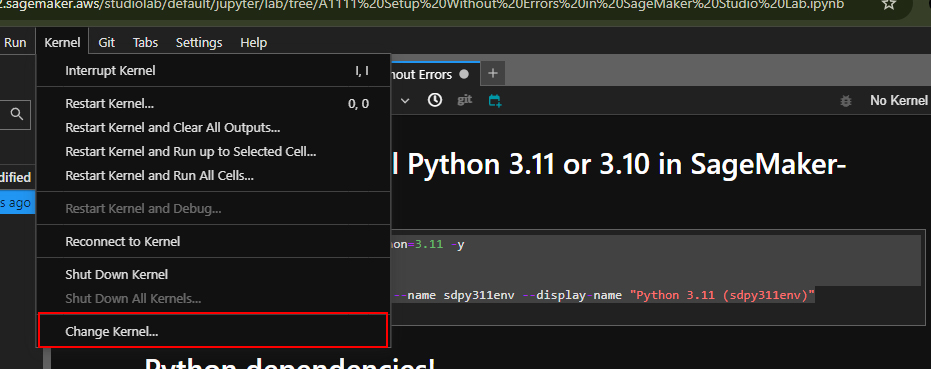
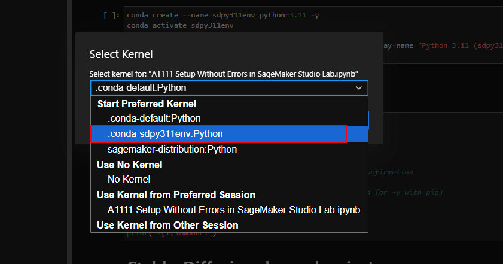
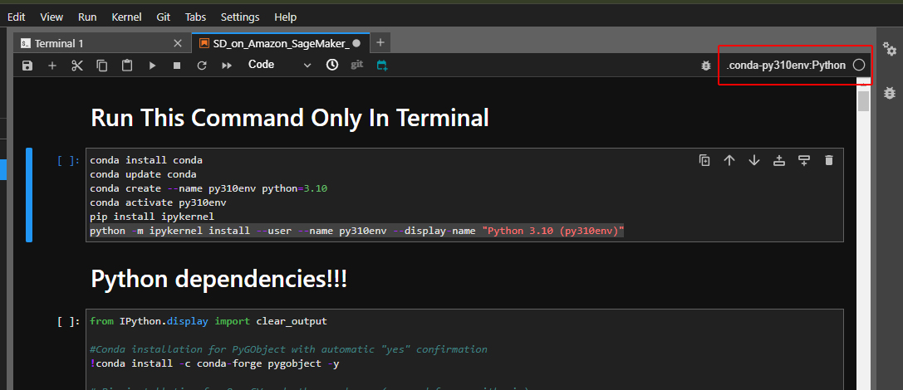

# Stable Diffusion Setup Without Errors in SageMaker Studio Lab

This guide will help you set up Stable Diffusion in SageMaker Studio Lab, with specific instructions to keep everything running smoothly.

## 🔧 Installation Steps
# This all **Set Up the Python3.11 Environment** commands also given in Notebook
## 1. **Set Up the Environment**
   - Use the **terminal** to run all installation commands.
     
#1.1. Create a Python 3.11 environment
```bash
conda create --name py310env python=3.11 -y
```
# 1.2. Activate the newly created environment
```bash
conda activate sdpy311env
```
# 1.3. Install ipykernel and set up the environment as a Jupyter kernel
```bash
pip install ipykernel
python -m ipykernel install --user --name sdpy311env --display-name "Python 3.11 (sdpy311env)"
```
# 1.4. Verify Python 3.11 is active in the environment
```bash
python --version
```
# 1.5. Install and update Conda
```bash
conda install -c conda-forge libglib -y 
conda update -n base conda -y
```
# ⚠️ Important Notes
- All commands are given below for Python notebook.
- If You are useing the terminal for installing A1111 then avoid to installing packages via the Notebook.

## 2.**Python dependencies installing in the Notebook If you are using  Terminal then remove ! this then run**

### For Notebook fist setup the kernel

   - Click on  Studio Lab
     
   

   - Click on Restart JupyterLab...

   

   - Select a Stable-Diffusion NoteBook and Click on Kernel
     
     

   - Click on Change Kernel
  
     

   - Select the .conda.py310env.Python Kernel
  
     

   - Makesure Right Kernel is selected
  
     
   - After setting up the environment
   - 🚫 **Install all necessary Python packages .
     
```bash
!conda install -c conda-forge pygobject -y
!pip install opencv-python
!pip install opencv-contrib-python
```
## 3.Stable-Diffusion dependencies
```bash
!pip install diffusers transformers accelerate scipy safetensors
!pip install torch torchvision --upgrade
!pip install xformers
```
## insightface for faceswaping optional if you are using
```
!pip install insightface
```
## 4.Stable-Diffusion after Cloning Installing Requirements
```
%cd ~/stable-diffusion-webui
!pip install -r requirements.txt
```
## 5.Launch (A1111WebUi)
- Replace ngrok token with your token "2XWKyblB2vN0oonn4F9owPN1gfL_4wZ4rxXdb8sPqsdfgW"
```
%cd ~/stable-diffusion-webui

!python launch.py --listen --xformers --enable-insecure-extension-access --gradio-queue --ngrok 2XWKyblB2vN0oonn4F9owPN1gfL_4wZ4rxXdb8sPqsdfgW

```

##  Requirements Ngrok Token
```bash
https://ngrok.com/
